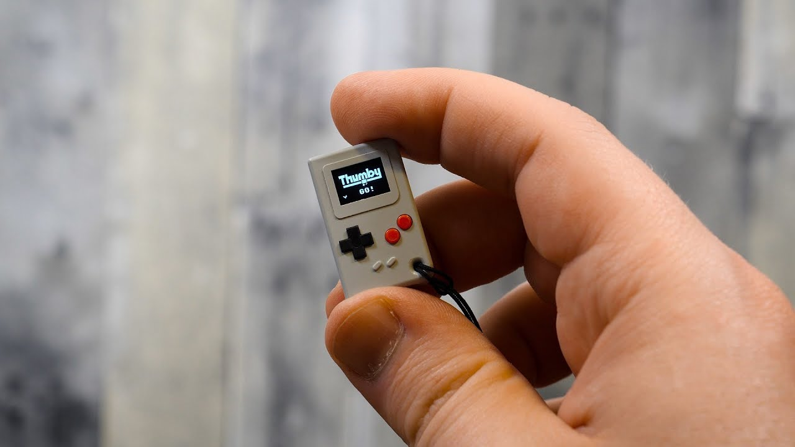
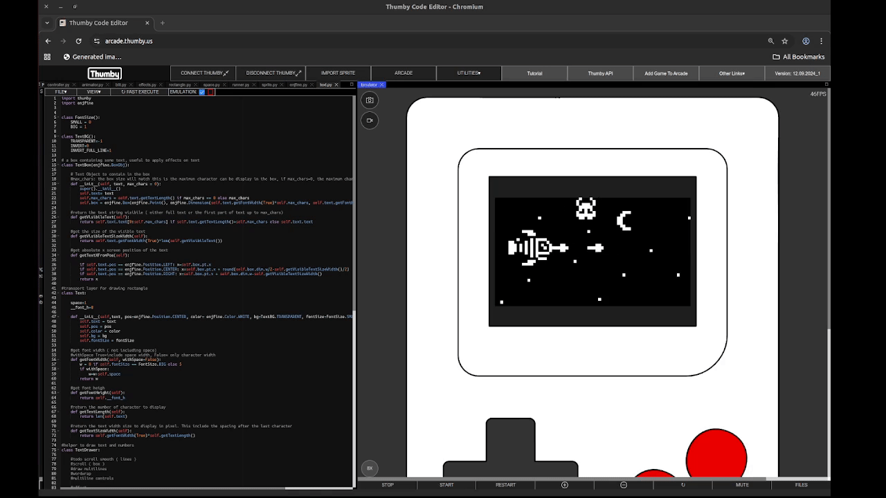
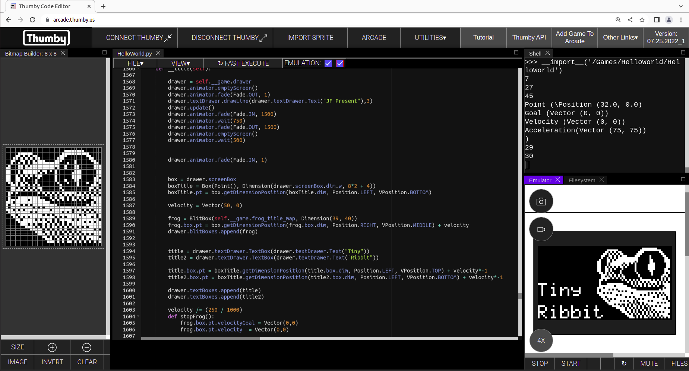

# 🎮 enjfine — A 2D Physics Game Engine for Thumby

> **Pure enthusiasm. Zero distractions. Just games.**

[](LICENSE)


---

## What is enjfine?

**enjfine** is a lightweight 2D physics game engine built specifically for the [Thumby](https://thumby.xyz/) — a pocket-sized, open-source game console with a 72×40 pixel monochrome display.

It started as a personal journey: learning Python, exploring game physics, and rediscovering the joy of coding without deadlines. What began as a pet project grew into a full-featured engine with vector math, collision detection, sprite animation, particle effects, and a clean game loop runner — all in pure Python.

> *"I coded games on the Game Boy Advance back in 2005. Now I wanted to explore more serious physics engines — but this time, using sota vector physic."*

---

## 📸 See It In Action

### The Thumby Device



*The Thumby — a tiny 72×40 pixel game console powered by an ARM Cortex-M0+.*

### Space Shooter Demo



*Space Shooter — a full shoot-'em-up with power-ups, explosions, and layered backgrounds.*

---

## Games & Demos

### Full Games

| Game | Description | Lines |
|------|-------------|-------|
| [Ribbit](src/ribbit.py) | A Frogger-inspired classic with 8 levels, turtle riding, and splash effects | ~500 |
| [Space Shooter](src/space.py) | A vertical shooter with ship upgrades, bombs, shields, and particle explosions | ~580 |

### roof-of-Concept latformer & Arcade Physic

| Game | Description | Engine Status |
|------|-------------|---------------|
| [Skull Platformer](src/platformer.py) | A parallax-scrolling platformer with a jumping skull hero | Ready |
| [Dragon Game](src/dragon.py) | A simple dragon movement demo showcasing physics controls | Ready |
| [Hockey](src/hockey.py) | Pong-meets-hockey with player collision and AI opponents | Code not ported — requires runner loop |
| [Kombat](src/kombat.py) | A fighting game prototype with punch, kick, and block animations | Code not ported — requires runner loop |


---

## Engine Architecture

enjfine is organized into modular components. Each file is self-contained and well-documented in-code.

### Core Modules

| Module | File | Purpose |
|--------|------|---------|
| **enjfine** | [`src/enjfine/enjfine.py`](src/enjfine/enjfine.py) | Core types: `Vector`, `Point`, `Box`, `Dimension`, `Grid`, `Drawer` |
| **Runner** | [`src/enjfine/runner.py`](src/enjfine/runner.py) | Game loop manager — handles title screen, gameplay, and game-over states |
| **Sprite** | [`src/enjfine/sprite.py`](src/enjfine/sprite.py) | `SpriteBox` with animation frames, masks, and effects (shake, flash, explode, splash) |
| **Animator** | [`src/enjfine/animator.py`](src/enjfine/animator.py) | Animation engine — fades, moves, rotates, timers, collision detection, FPS tracking |
| **Controller** | [`src/enjfine/controller.py`](src/enjfine/controller.py) | Input handling — grid move, two-axis free move, platformer jump, one-axis button move |
| **Blit** | [`src/enjfine/blit.py`](src/enjfine/blit.py) | Raw bitmap drawing with mirroring support |
| **Text** | [`src/enjfine/text.py`](src/enjfine/text.py) | Text rendering with small/big fonts, positioning, and background modes |
| **Rectangle** | [`src/enjfine/rectangle.py`](src/enjfine/rectangle.py) | Filled and outlined rectangle drawing |

### Key Features

- **Vector Math** — Full `Vector` class with dot product, normalization, arithmetic operators
- **Physics-Based Movement** — Velocity, acceleration, and goal-based motion smoothing
- **Collision Detection** — AABB collision with configurable parent boundary effects (wrap, bounce, block)
- **Sprite System** — Animated sprites with mask-based transparency and collision boxes
- **Particle Effects** — Explosions, splashes, shakes, flashes, circle waves, invisibility
- **Layered Backgrounds** — Parallax scrolling with multiple background layers
- **Non-Blocking Timers** — Delay, tick, and do-until patterns for clean game logic
- **Aim-to-Target** — Quadratic equation-based trajectory calculation for smart aiming

---

## 🚀 Getting Started

### Prerequisites

- A [Thumby device](https://thumby.us/) (or the [Thumby web emulator](https://arcade.thumby.us/))
- A modern web browser for the Thumby Game Editor

### Running a Game

1. **Open the Thumby Game Editor** at [https://arcade.thumby.us/](https://arcade.thumby.us/)

2. **Add the engine files** — Click the `+` button to add each file from this repo:

   | File | Where to Put It |
   |------|-----------------|
   | `enjfine.py` | `/Games/enjfine/enjfine.py` |
   | `runner.py` | `/Games/enjfine/runner.py` |
   | `sprite.py` | `/Games/enjfine/sprite.py` |
   | `animator.py` | `/Games/enjfine/animator.py` |
   | `controller.py` | `/Games/enjfine/controller.py` |
   | `blit.py` | `/Games/enjfine/blit.py` |
   | `text.py` | `/Games/enjfine/text.py` |
   | `rectangle.py` | `/Games/enjfine/rectangle.py` |

3. **Add your game file** — For example, add `ribbit.py` to `/Games/enjfine/ribbit.py`

4. **Set the path for each file** — Make sure every path starts with `/Games/enjfine/`

5. **Select your main game file** as the starting file in the emulator

6. **Press Start** to load and play!

> 💡 **Tip:** You can copy-paste the file contents directly from this repo into the editor. No need to transfer files manually — the web editor handles everything.

### Using the Thumby Game Editor



*The Thumby web editor lets you write, test, and flash your games directly from your browser.*

### Transferring to Real Hardware

After testing in the emulator:

1. Connect your Thumby to your computer via USB
2. The Thumby will appear as a USB drive
3. Create the `/Games/enjfine/` folder on the device
4. Copy all engine files and your game file to the appropriate paths
5. Disconnect and power on — your game is ready to play!

---

## Writing Your Own Game

Creating a new game with enjfine is simple. Every game needs just two things:

### 1. The Game Class

```python
class MyGame:
    title1 = "My"       # Title screen line 1
    title2 = "Game"     # Title screen line 2
    game_map = bytearray([...])  # Optional: title screen image

    def initGame(self):
        # Set up your sprites, backgrounds, score, etc.
        self.__hero = enjfine.sprite.SpriteBox(my_bitmap, enjfine.Dimension(8, 8))
        self.drawer.data.spriteBoxes.append(self.__hero)

    def update(self):
        # Game logic called every frame
        self.drawer.controller.twoAxisFreeMove(self.__hero)
        return True  # Return False to end the game
```

### 2. The Runner

```python
runner = enjfine.runner.GameRunner(MyGame())
runner.run()
```

That's it! The runner handles the title screen, game loop, and game-over screen automatically.

### Available Controls

| Method | Use Case |
|--------|----------|
| `twoAxisFreeMove(spriteBox)` | Free movement in all directions (great for top-down games) |
| `twoAxisGridMove(spriteBox)` | Grid-based movement (perfect for Frogger-like games) |
| `platformerJumper(spriteBox)` | Platformer controls with gravity and jumping |
| `OneAxisOneButtonMove(spriteBox)` | Single-axis movement toggled by button press |

### Available Effects

| Effect | Description |
|--------|-------------|
| `ExploseEffect` | Particle explosion from sprite center |
| `SplashEffect` | Particles spray in a direction |
| `ShakeEffect` | Screen shake on target |
| `FlashEffect` | Invert colors for a flash |
| `HideEffect` | Fade out and hide a sprite |
| `CircleWaveEffect` | Expanding circle wave animation |
| `BackgroundEffect` | Layered scrolling backgrounds |

---

## Project Structure

```
enjfine/
├── LICENSE                          # MIT License
├── notes                            # Project notes & ideas
├── docs/
│   └── imagers/
│       ├── editor.png               # Thumby editor screenshot
│       ├── space-shooter.gif        # Space Shooter gameplay
│       └── thumby-hardware.jpg      # Thumby device photo
├── poc/                             # Proof-of-concept experiments
│   ├── blood.py
│   ├── charger.py
│   ├── dragon.dots.py
│   ├── dragon.dots.mask.py
│   ├── luv.poulet.py
│   └── thumbcat.combat.py
├── sprites/                         # Sprite source files (XCF, PNG)
│   ├── fight.xcf
│   ├── fire.xcf
│   ├── fish.xcf
│   ├── ribbit-title.xcf
│   ├── space.xcf
│   ├── splash.xcf
│   └── output/                      # Rendered sprite PNGs
└── src/
    ├── dragon.py                    # Dragon movement demo
    ├── hockey.py                    # Hockey game
    ├── kombat.py                    # Fighting game prototype
    ├── platformer.py                # Skull platformer
    ├── ribbit.py                    # Frogger clone (full game)
    ├── space.py                     # Space shooter (full game)
    └── enjfine/                     # The engine!
        ├── enjfine.py               # Core types & Drawer
        ├── runner.py                # Game loop runner
        ├── sprite.py                # SpriteBox & effects
        ├── animator.py              # Animation & timers
        ├── controller.py            # Input handling
        ├── blit.py                  # Raw bitmap drawing
        ├── text.py                  # Text rendering
        └── rectangle.py             # Rectangle drawing
```

---

## Customizing Sprites

Sprites are defined as `bytearray` bitmaps in the game files. To create your own:

1. Design your sprite on a grid (typically 7–16 pixels wide)
2. Convert to binary hex values (each row becomes a byte)
3. Replace the existing `bytearray` in the source

> **Pro tip:** Tools like [Lospec Pixel Editor](https://lospec.com/pixel-editor) or [Aseprite](https://www.aseprite.org/) can help you design and export sprite data.

---

## Contributing

This project is a labor of love — a personal journey into Python game development. Feel free to:

- **Fork and experiment** — The engine is designed to be hacked and extended
- **Submit ideas** — Open an issue with your game concepts
- **Share your games** — We'd love to see what you build with enjfine

---

## License

This project is licensed under the MIT License — see the [`LICENSE`](LICENSE) file for details.

---

## 💛 Made With Enthusiasm

enjfine was born from a simple desire: **to code for the joy of coding**. No deadlines, no meetings, no pressure — just pure creativity on a tiny 72×40 pixel canvas.

If you find this project useful, fun, or inspiring, g do make something awesome! 🚀

---

*Built for the Thumby community, with love and vectors.*
